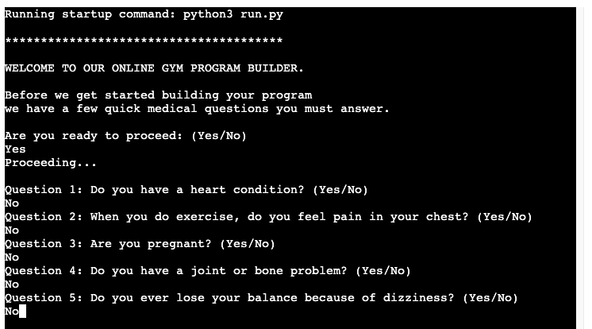

# Program Builder

This Python based Program Builder is designed to allow the user to create a custom gym training program that is specific to their needs. The program has 2 options for a gym program, Muscle Building and Strength Building and depending on the information, such as the type of split they would like, the number of days they are looking to train and the weight they lifted on their last gym session the program will build a full workout that the user can follow and take all the guesswork out of their training.

## Features

### Site Goals

* The goal of the site is to provide the user with a very simple but detailed approach to creating a gym program tailored to their goals.

### Target Audience

* Anyone who is familiar with a gym environment and resistance training exercises but doesn't know where to start with regards to the program to follow.

### App Walkthrough

* MAIN MENU
    * Upon loading the app the user will be welcomed and asked if they are ready to first answer a series of medical questions (Medical Par-Q Form) before a gym program is created.
    * This is to ensure that before the user starts training that there are no issues that may cause an injury.
    * This user is asked to answer yes or no. Yes will bring them to the questions and no will ask them to return to the app when they are ready

* MEDICAL QUESTIONS (Medical Par-Q Form)
    * There are 5 questions in total the user must answer one at a time.
        * Question 1: Do you have a heart condition? (Yes/No)
        * Question 2: When you do physical activity, do you feel pain in your chest? (Yes/No)
        * Question 3: Are you pregnant? (Yes/No)
        * Question 4: Do you have a joint or bone problem? (Yes/No)
        * Question 5: Do you ever lose consciousness or Do you lose your balance because of dizziness? (Yes/No)

* If the user answers "Yes" to any of these questions they will be shown a message asking them to first obtain medical clearance before continuing and the app will jump back to the main menu section.

* If the user answers “No” to all questions they will be clear to proceed to the next section of the app.

* PROGRAM OPTIONS
    * After the user has passed the medical questions they are asked to choose from 2 types of gym program.
        * Muscle Building Program
        * Strength Building Program
    * The user must enter 1 or 2 to make their selection.

* MUSCLE BUILDING PROGRAM
    * If the user chooses the Muscle Building Program they are then asked about what type of muscle building program they would like, the options are:
        * Full Body Training Split
        * Upper/Lower Training Split
        * Push, Pull, Legs Training Split
    * The user will then select and option by inputting 1, 2, or 3

* MUSCLE BUILDING PROGRAM - FREQUENCY
    * After choosing one of the options for a type of muscle building program the user will then be asked about their preference for training frequency.
    * Depending on the chosen split the options can be anywhere from 2 days a week to 5/6 days per week.
    * Once a user has chosen their desired frequency the app will build their muscle building program.

* MUSCLE BUILDING PROGRAM - THE FINISHED PROGRAMS
    * With the frequency chosen the user's type specific program will be built and displayed on screen.
    * Underneath the program the user will also see notes on the program such as what order to complete the workouts in and when they should take rest days.

* After the program and program info has been built and displayed the user will asked to press any key and enter to continue and then be presented with another menu with the following options
    * They can go to the Strength Building Program section
    * They can go back to the Muscle Building Program section
    * They can go back to the Main Menu
    * They can exit the app

* STRENGTH BUILDING PROGRAM
    * The second option the user has in terms of type of program is a Strength Building Program.
    * In this section the user will be asked to input some info from the previous workouts in order to allow for the app to work out starting weights when the final program is designed.
    * The user is asked to input the weight they lifted in kg and for how many reps for the exercises Squat, Bench, and Deadlift.
    * The user will be asked to enter this info 1 at a time and then the custom program will be built.
    * If the user has never performed these lifts before they are instructed to first perform these exercises in a gym first for a few sessions and then return to the app to enter the info.

* 
